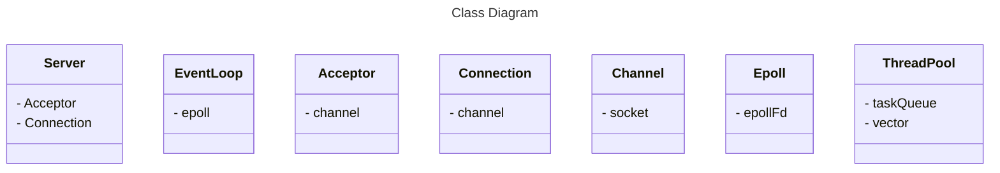

# Cpp web server 学习项目

我为什么要写这个项目呢？
大方向上来说，是为了求职，当前我的工作背景没有网络相关，也没有后端服务器相关，因此需要通过这个项目去了解和熟悉网络变成和后端开发

那么具体一些，我想我需要学会的东西有如下
1. 网络编程API的使用
2. 后端代码的框架，有哪些类
3. OOP思想的实践，如何使代码更加符合SOLID原则

学习策略，先跟着项目把基本的环节都摸透，然后再自己探索拓展

## Day 22 日志模块


### Buffer
# C++ 高性能日志 Buffer 类设计与实现

基于你的需求，我来为你设计一个生产级的高性能 C++ 日志 Buffer 类。这个设计将满足服务器环境下的高并发、低延迟需求。

## 🎯 设计目标

- **零动态内存分配**：避免 new/delete 开销
    
- **高写入吞吐**：批量写入，减少系统调用
    
- **线程安全**：支持多线程并发写入
    
- **低延迟**：异步刷新，不阻塞业务线程
    

## 🏗️ 核心实现方案

### 方案1：固定大小缓冲区（FixedBuffer） - 基础版本

```
#include <cstring>
#include <string>
#include <algorithm>

template<size_t SIZE>
class FixedBuffer {
public:
    FixedBuffer() : cur_(data_) {
        setCookie(cookieStart);
    }
    
    ~FixedBuffer() {
        setCookie(cookieEnd);
    }
    
    // 追加数据，返回实际写入的字节数
    size_t append(const char* buf, size_t len) {
        return appendInternal(buf, len);
    }
    
    // 追加字符串
    size_t append(const std::string& str) {
        return appendInternal(str.data(), str.length());
    }
    
    // 追加单个字符
    void append(char c) {
        if (avail() > 0) {
            *cur_ = c;
            cur_++;
        }
    }
    
    // 获取当前数据长度
    size_t length() const {
        return static_cast<size_t>(cur_ - data_);
    }
    
    // 获取剩余空间
    size_t avail() const {
        return static_cast<size_t>(end() - cur_);
    }
    
    // 获取数据指针
    const char* data() const {
        return data_;
    }
    
    // 清空缓冲区
    void reset() {
        cur_ = data_;
    }
    
    // 转换为字符串
    std::string toString() const {
        return std::string(data_, length());
    }
    
    // 检查是否为空
    bool empty() const {
        return cur_ == data_;
    }
    
    // 检查是否已满
    bool full() const {
        return avail() == 0;
    }

private:
    // 禁用拷贝（日志缓冲区通常不应该被拷贝）
    FixedBuffer(const FixedBuffer&) = delete;
    FixedBuffer& operator=(const FixedBuffer&) = delete;
    
    const char* end() const {
        return data_ + SIZE;
    }
    
    size_t appendInternal(const char* buf, size_t len) {
        size_t toWrite = std::min(len, avail());
        if (toWrite > 0) {
            std::memcpy(cur_, buf, toWrite);
            cur_ += toWrite;
        }
        return toWrite;
    }
    
    // 用于调试的cookie机制
    void setCookie(void (*cookie)()) {
        cookie_ = cookie;
    }
    static void cookieStart() {}
    static void cookieEnd() {}
    
    char data_[SIZE];
    char* cur_;
    void (*cookie_)();
};
```

### 方案2：双缓冲区（DoubleBuffer） - 生产环境推荐

```
#include <mutex>
#include <condition_variable>
#include <thread>
#include <vector>
#include <memory>
#include <atomic>

template<size_t BUFFER_SIZE>
class DoubleBuffer {
public:
    DoubleBuffer(size_t flush_threshold = BUFFER_SIZE * 0.8) 
        : flush_threshold_(flush_threshold)
        , running_(true) {
        // 启动后台刷新线程
        flush_thread_ = std::thread(&DoubleBuffer::flushThreadFunc, this);
    }
    
    ~DoubleBuffer() {
        stop();
    }
    
    // 追加日志数据（线程安全）
    size_t append(const char* data, size_t len) {
        std::lock_guard<std::mutex> lock(mutex_);
        
        // 检查是否需要交换缓冲区
        if (current_buffer_->length() + len >= flush_threshold_) {
            swapBuffers();
        }
        
        size_t written = current_buffer_->append(data, len);
        if (written > 0) {
            // 通知后台线程（如果达到阈值）
            if (current_buffer_->length() >= flush_threshold_) {
                cond_.notify_one();
            }
        }
        
        return written;
    }
    
    size_t append(const std::string& str) {
        return append(str.data(), str.length());
    }
    
    // 强制刷新所有缓冲数据
    void flush() {
        {
            std::lock_guard<std::mutex> lock(mutex_);
            swapBuffers();
        }
        cond_.notify_one();
        
        // 等待刷新完成
        std::unique_lock<std::mutex> lock(mutex_);
        cond_.wait(lock, [this]() { 
            return full_buffers_.empty(); 
        });
    }
    
    // 停止后台线程
    void stop() {
        if (running_) {
            running_ = false;
            cond_.notify_all();
            if (flush_thread_.joinable()) {
                flush_thread_.join();
            }
        }
    }
    
    // 设置刷新回调函数（实际写入文件等）
    void setFlushCallback(std::function<void(const char*, size_t)> callback) {
        flush_callback_ = callback;
    }

private:
    void swapBuffers() {
        if (!current_buffer_->empty()) {
            full_buffers_.push_back(std::move(current_buffer_));
            current_buffer_ = std::make_unique<FixedBuffer<BUFFER_SIZE>>();
        }
    }
    
    void flushThreadFunc() {
        while (running_) {
            std::unique_lock<std::mutex> lock(mutex_);
            
            // 等待有数据需要刷新或停止信号
            cond_.wait(lock, [this]() {
                return !full_buffers_.empty() || !running_;
            });
            
            if (!running_) break;
            
            // 获取所有需要刷新的缓冲区
            std::vector<std::unique_ptr<FixedBuffer<BUFFER_SIZE>>> buffers_to_flush;
            buffers_to_flush.swap(full_buffers_);
            
            lock.unlock();
            
            // 执行实际刷新操作
            for (auto& buffer : buffers_to_flush) {
                if (flush_callback_ && !buffer->empty()) {
                    flush_callback_(buffer->data(), buffer->length());
                }
            }
        }
        
        // 退出前刷新剩余数据
        std::lock_guard<std::mutex> lock(mutex_);
        for (auto& buffer : full_buffers_) {
            if (flush_callback_ && !buffer->empty()) {
                flush_callback_(buffer->data(), buffer->length());
            }
        }
        if (!current_buffer_->empty()) {
            flush_callback_(current_buffer_->data(), current_buffer_->length());
        }
    }
    
    std::mutex mutex_;
    std::condition_variable cond_;
    std::atomic<bool> running_;
    
    std::unique_ptr<FixedBuffer<BUFFER_SIZE>> current_buffer_ = 
        std::make_unique<FixedBuffer<BUFFER_SIZE>>();
    std::vector<std::unique_ptr<FixedBuffer<BUFFER_SIZE>>> full_buffers_;
    
    size_t flush_threshold_;
    std::function<void(const char*, size_t)> flush_callback_;
};
```

### 方案3：无锁环形缓冲区（最高性能）

```
#include <atomic>
#include <cassert>

template<size_t SIZE>
class RingBuffer {
public:
    RingBuffer() : read_index_(0), write_index_(0) {
        static_assert(SIZE > 0, "Buffer size must be positive");
        static_assert((SIZE & (SIZE - 1)) == 0, "Buffer size must be power of 2");
    }
    
    // 无锁写入，返回实际写入的字节数
    size_t write(const char* data, size_t len) {
        size_t write_index = write_index_.load(std::memory_order_relaxed);
        size_t read_index = read_index_.load(std::memory_order_acquire);
        
        size_t avail = writableBytes(read_index, write_index);
        if (avail == 0) return 0;
        
        size_t to_write = std::min(len, avail);
        
        // 处理回绕
        size_t first_chunk = std::min(to_write, SIZE - (write_index & (SIZE - 1)));
        std::memcpy(buffer_ + (write_index & (SIZE - 1)), data, first_chunk);
        
        if (to_write > first_chunk) {
            std::memcpy(buffer_, data + first_chunk, to_write - first_chunk);
        }
        
        write_index_.store(write_index + to_write, std::memory_order_release);
        return to_write;
    }
    
    // 读取数据，返回实际读取的字节数
    size_t read(char* dest, size_t len) {
        size_t write_index = write_index_.load(std::memory_order_acquire);
        size_t read_index = read_index_.load(std::memory_order_relaxed);
        
        size_t avail = readableBytes(write_index, read_index);
        if (avail == 0) return 0;
        
        size_t to_read = std::min(len, avail);
        
        // 处理回绕
        size_t first_chunk = std::min(to_read, SIZE - (read_index & (SIZE - 1)));
        std::memcpy(dest, buffer_ + (read_index & (SIZE - 1)), first_chunk);
        
        if (to_read > first_chunk) {
            std::memcpy(dest + first_chunk, buffer_, to_read - first_chunk);
        }
        
        read_index_.store(read_index + to_read, std::memory_order_release);
        return to_read;
    }
    
    // 可读字节数
    size_t readableBytes() const {
        size_t write_index = write_index_.load(std::memory_order_acquire);
        size_t read_index = read_index_.load(std::memory_order_acquire);
        return readableBytes(write_index, read_index);
    }
    
    // 可写字节数
    size_t writableBytes() const {
        size_t write_index = write_index_.load(std::memory_order_acquire);
        size_t read_index = read_index_.load(std::memory_order_acquire);
        return writableBytes(read_index, write_index);
    }
    
    bool empty() const {
        return readableBytes() == 0;
    }
    
    bool full() const {
        return writableBytes() == 0;
    }

private:
    size_t readableBytes(size_t write_index, size_t read_index) const {
        return write_index - read_index;
    }
    
    size_t writableBytes(size_t read_index, size_t write_index) const {
        return SIZE - (write_index - read_index);
    }
    
    char buffer_[SIZE];
    std::atomic<size_t> read_index_;
    std::atomic<size_t> write_index_;
};
```

## 🔄 完整的日志系统架构

### 日志条目格式化器

```
#include <chrono>
#include <sstream>
#include <iomanip>

class LogFormatter {
public:
    static std::string format(const std::string& level, 
                             const std::string& file, 
                             int line, 
                             const std::string& message) {
        std::ostringstream oss;
        
        // 时间戳
        auto now = std::chrono::system_clock::now();
        auto time_t = std::chrono::system_clock::to_time_t(now);
        oss << std::put_time(std::localtime(&time_t), "%Y-%m-%d %H:%M:%S");
        
        // 毫秒部分
        auto ms = std::chrono::duration_cast<std::chrono::milliseconds>(
            now.time_since_epoch()) % 1000;
        oss << "." << std::setfill('0') << std::setw(3) << ms.count();
        
        // 线程ID
        oss << " [T:" << std::this_thread::get_id() << "]";
        
        // 日志级别
        oss << " [" << level << "]";
        
        // 源文件位置
        oss << " [" << file << ":" << line << "]";
        
        // 日志消息
        oss << " " << message;
        
        return oss.str();
    }
};
```

### 异步日志系统核心

```
#include <functional>
#include <queue>

class AsyncLogger {
public:
    enum LogLevel {
        DEBUG,
        INFO,
        WARN,
        ERROR,
        FATAL
    };
    
    AsyncLogger(const std::string& log_file, size_t buffer_size = 4 * 1024) 
        : buffer_(buffer_size),
          running_(true),
          flush_interval_(std::chrono::seconds(3)) {
        
        // 设置刷新回调
        buffer_.setFlushCallback([this](const char* data, size_t len) {
            writeToFile(data, len);
        });
        
        // 启动后台线程
        flush_thread_ = std::thread(&AsyncLogger::flushThreadFunc, this);
    }
    
    ~AsyncLogger() {
        stop();
    }
    
    void log(LogLevel level, const std::string& file, int line, const std::string& message) {
        std::string level_str;
        switch (level) {
            case DEBUG: level_str = "DEBUG"; break;
            case INFO:  level_str = "INFO";  break;
            case WARN:  level_str = "WARN";  break;
            case ERROR: level_str = "ERROR"; break;
            case FATAL: level_str = "FATAL"; break;
        }
        
        std::string formatted = LogFormatter::format(level_str, file, line, message);
        buffer_.append(formatted + "\n");
    }
    
    void flush() {
        buffer_.flush();
    }
    
    void stop() {
        running_ = false;
        buffer_.stop();
        if (flush_thread_.joinable()) {
            flush_thread_.join();
        }
    }

private:
    void writeToFile(const char* data, size_t len) {
        std::lock_guard<std::mutex> lock(file_mutex_);
        
        if (!log_file_.is_open()) {
            openLogFile();
        }
        
        if (log_file_.is_open()) {
            log_file_.write(data, len);
            log_file_.flush();
        }
    }
    
    void openLogFile() {
        // 实现日志文件滚动逻辑
        std::string filename = generateLogFileName();
        log_file_.open(filename, std::ios::app | std::ios::binary);
        
        if (!log_file_.is_open()) {
            std::cerr << "无法打开日志文件: " << filename << std::endl;
        }
    }
    
    std::string generateLogFileName() {
        // 实现文件命名：进程名+创建日期+创建时间+机器名+进程id+后缀log
        auto now = std::chrono::system_clock::now();
        auto time_t = std::chrono::system_clock::to_time_t(now);
        
        std::ostringstream oss;
        oss << "server_" 
            << std::put_time(std::localtime(&time_t), "%Y%m%d_%H%M%S")
            << "_" << getpid() << ".log";
        
        return oss.str();
    }
    
    void flushThreadFunc() {
        while (running_) {
            std::this_thread::sleep_for(flush_interval_);
            buffer_.flush();
        }
    }
    
    DoubleBuffer<4096> buffer_;
    std::ofstream log_file_;
    std::mutex file_mutex_;
    std::thread flush_thread_;
    std::atomic<bool> running_;
    std::chrono::seconds flush_interval_;
};
```

### 便捷的日志宏

```
// 日志宏定义
#define LOG_DEBUG(message) AsyncLogger::getInstance().log(AsyncLogger::DEBUG, __FILE__, __LINE__, message)
#define LOG_INFO(message)  AsyncLogger::getInstance().log(AsyncLogger::INFO, __FILE__, __LINE__, message)
#define LOG_WARN(message)  AsyncLogger::getInstance().log(AsyncLogger::WARN, __FILE__, __LINE__, message)
#define LOG_ERROR(message) AsyncLogger::getInstance().log(AsyncLogger::ERROR, __FILE__, __LINE__, message)
#define LOG_FATAL(message) AsyncLogger::getInstance().log(AsyncLogger::FATAL, __FILE__, __LINE__, message)

// 流式日志支持
class LogStream {
public:
    LogStream(AsyncLogger::LogLevel level, const std::string& file, int line)
        : level_(level), file_(file), line_(line) {}
    
    ~LogStream() {
        AsyncLogger::getInstance().log(level_, file_, line_, stream_.str());
    }
    
    template<typename T>
    LogStream& operator<<(const T& value) {
        stream_ << value;
        return *this;
    }

private:
    AsyncLogger::LogLevel level_;
    std::string file_;
    int line_;
    std::ostringstream stream_;
};

#define LOG_STREAM(level) LogStream(AsyncLogger::level, __FILE__, __LINE__)
#define LOG_DEBUG_STREAM LOG_STREAM(DEBUG)
#define LOG_INFO_STREAM  LOG_STREAM(INFO)
```

## ⚡ 性能优化技巧

### 1. 内存对齐优化

```
#include <immintrin.h>  // SSE/AVX 指令集

template<size_t SIZE>
class AlignedBuffer {
public:
    AlignedBuffer() {
        // 64字节对齐，避免伪共享
        data_ = static_cast<char*>(_mm_malloc(SIZE, 64));
        cur_ = data_;
    }
    
    ~AlignedBuffer() {
        _mm_free(data_);
    }
    
    // ... 其他方法实现与 FixedBuffer 类似

private:
    char* data_;
    char* cur_;
};
```

### 2. 批量格式化优化

```
class HighPerformanceFormatter {
public:
    HighPerformanceFormatter() {
        buffer_.reserve(1024);  // 预分配内存
    }
    
    template<typename... Args>
    const std::string& format(Args&&... args) {
        buffer_.clear();
        formatImpl(std::forward<Args>(args)...);
        return buffer_;
    }

private:
    template<typename T, typename... Args>
    void formatImpl(T&& first, Args&&... rest) {
        buffer_.append(std::forward<T>(first));
        if constexpr (sizeof...(rest) > 0) {
            formatImpl(std::forward<Args>(rest)...);
        }
    }
    
    void formatImpl() {}  // 递归终止
    
    std::string buffer_;
};
```

## 📊 方案对比与选择建议

|方案|适用场景|性能|复杂度|线程安全|
|---|---|---|---|---|
|**FixedBuffer**​|单线程简单场景|⭐⭐⭐⭐|⭐⭐|❌|
|**DoubleBuffer**​|生产环境通用|⭐⭐⭐⭐⭐|⭐⭐⭐⭐|✅|
|**RingBuffer**​|极高并发场景|⭐⭐⭐⭐⭐|⭐⭐⭐⭐⭐|✅|

## 🎯 推荐的生产环境配置

```
// 生产环境推荐配置
class ProductionLogger {
public:
    static ProductionLogger& getInstance() {
        static ProductionLogger instance;
        return instance;
    }
    
    void init(const std::string& log_dir = "./logs") {
        log_dir_ = log_dir;
        // 创建日志目录
        std::filesystem::create_directories(log_dir_);
    }
    
    void log(LogLevel level, const std::string& file, int line, const std::string& message) {
        // 使用双缓冲区，4KB缓冲区大小，80%阈值刷新
        static DoubleBuffer<4096> buffer(4096 * 0.8);
        
        std::string formatted = formatEntry(level, file, line, message);
        buffer.append(formatted);
    }

private:
    std::string log_dir_;
    
    std::string formatEntry(LogLevel level, const std::string& file, int line, const std::string& message) {
        // 高性能格式化实现
        // ...
    }
};

// 使用示例
int main() {
    ProductionLogger::getInstance().init("/var/log/myapp");
    
    for (int i = 0; i < 1000000; ++i) {
        LOG_INFO("Processing request #" << i);
    }
    
    return 0;
}
```

## 💡 高级特性：日志滚动策略

```
class RollingFileAppender {
public:
    RollingFileAppender(const std::string& base_name, 
                       size_t max_size, 
                       int max_files)
        : base_name_(base_name),
          max_size_(max_size),
          max_files_(max_files),
          current_size_(0) {}
    
    void append(const char* data, size_t len) {
        if (current_size_ + len > max_size_) {
            rollFile();
        }
        
        file_.write(data, len);
        current_size_ += len;
    }
    
    void rollFile() {
        if (file_.is_open()) {
            file_.close();
        }
        
        // 实现文件滚动逻辑
        std::string new_filename = generateRollingFileName();
        file_.open(new_filename, std::ios::app | std::ios::binary);
        current_size_ = 0;
        
        // 清理旧文件
        cleanupOldFiles();
    }

private:
    std::string generateRollingFileName() {
        auto now = std::chrono::system_clock::now();
        auto time_t = std::chrono::system_clock::to_time_t(now);
        
        std::ostringstream oss;
        oss << base_name_ << "." 
            << std::put_time(std::localtime(&time_t), "%Y%m%d_%H%M%S")
            << ".log";
        
        return oss.str();
    }
    
    void cleanupOldFiles() {
        // 实现旧文件清理逻辑
        // 保留最近 max_files_ 个文件
    }
    
    std::string base_name_;
    size_t max_size_;
    int max_files_;
    size_t current_size_;
    std::ofstream file_;
};
```

## 💎 总结

**C++ 高性能日志 Buffer 的核心设计原则**：

1. **零动态分配**：使用固定大小数组，避免运行时内存分配
    
2. **批量处理**：积累足够数据后一次性写入，减少系统调用
    
3. **异步刷新**：后台线程负责 I/O，不阻塞业务逻辑
    
4. **线程安全**：合理使用锁或无锁数据结构
    
5. **内存友好**：考虑缓存行对齐，避免伪共享
    

**推荐配置参数**：

- 缓冲区大小：4KB - 64KB（根据日志频率调整）
    
- 刷新阈值：缓冲区大小的 70-80%
    
- 刷新间隔：1-3 秒
    
- 文件滚动：按大小（如 100MB）或按时间（如每天）
    

这样的设计可以支撑服务器在高并发场景下（每秒数万条日志）的日志需求，同时保持亚毫秒级的写入延迟。


## Day 17 EventLoopThreadPool

EventLoopThreadPooll类的意义是将sub_reactor的创建从MainReactor的业务逻辑中剥离开来，DeepSeek对此提出了一个很恰当的比喻

main Reactor就像是餐厅的接待经理，他不需要负责每一个接待服务员(eventLoop)的招聘，他只负责将新来的客人(connection)安排给空闲的接待服务员即可，将服务员的招聘的任务也交给接待经理，其实是让接待经理的职责不单一，并且与不相关的业务过度耦合，一旦服务员要更换业务，接待经理也需要重新学习如何招聘新的服务员，就会导致原来不需要的配套，也就是耦合了。最后ThreadId就好像接待服务员的编号，其实在招聘来时就可以固定好编号，而不必说等到要安排客人的时候才临时安排编号，这样不利于管理。


## Thread-Safe Queue

参考 C++ Concurrency in Action中的基于锁的实现，将头指针和尾指针分开访问

首先，设计接口！
1. push
2. try_pop
3. wait and pop

## Epoll

epoll_create1(0) 创建epoll fd
epoll_ctl将socket的EPOLLIN事件注册到epollFd对应的实例中
epoll_wait(epollFd, events, MAX_EVENTS, -1); 将触发的时间存到events数组中

