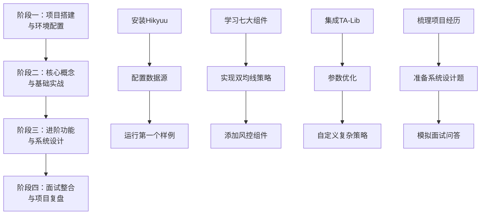

Hikyuu Project Learning

## DeepSeek Suggestion

你选择通过Hikyuu项目来学习并准备量化C++岗位的面试，这是一个非常明智的决定。这个项目能让你在实战中掌握行业真正需要的核心技术。下面我为你规划一条系统性的学习路径。

### 🧠 理解Hikyuu的核心价值

Hikyuu框架最大的优势在于其**组件化设计** 。它将一个复杂的交易系统拆解为七个核心组件，这种“搭积木”的方式，让你可以分而治之，逐个击破，非常适合学习和面试准备 。

为了让你快速建立整体印象，下表概括了这七大核心组件及其在面试中可能考察的点：

| 核心组件 | 面试考察点 | 你的学习目标 |
| :--- | :--- | :--- |
| **信号指示器 (Signal)** | 策略逻辑、指标实现能力 | 如何实现一个均线金叉买卖信号 |
| **资金管理 (MoneyManager)** | 风险意识、数学模型应用 | 如何根据账户资金动态计算仓位 |
| **止损/止盈 (StopLoss/ProfitGoal)** | 系统稳定性思维 | 如何实现浮动止损或回撤止盈 |
| **市场环境判断 (Environment)** | 对市场周期的理解 | 如何定义“牛市”或“震荡市”并控制仓位 |
| **系统有效条件 (Condition)** | 策略的严谨性 | 如何设置策略生效的“总开关” |
| **移滑价差算法 (Slippage)** | 对实盘交易细节的关注 | 如何模拟交易时的冲击成本 |

### 🗺️ 四阶段学习路线图

下图为你勾勒了从入门到精通的完整学习旅程，你可以清晰地看到每个阶段的核心任务与目标。

#### **阶段一：项目搭建与环境配置 (第1周)**

这个阶段的目标是把Hikyuu在你自己电脑上跑起来。

1.  **安装与配置**：严格按照官方文档或可靠的教程进行 。对于C++开发者，建议从源码编译安装，这能让你更深入地理解项目结构。
2.  **数据准备**：Hikyuu支持多种数据源。先从框架自带的图形化工具（执行 `hikyuutdx` 命令）下载A股日线数据开始，这是最直接的方式 。
3.  **跑通第一个示例**：目标是让官方的“双均线金叉死叉”策略示例代码成功运行并看到回测结果。这一步能帮你建立信心，并验证环境是否正确。

#### **阶段二：核心概念与基础实战 (第2-4周)**

这是最关键的阶段，你需要深入代码，理解每个组件的职责和交互方式。

1.  **精读一个简单策略的源码**：以“海龟交易法则”或“双均线策略”为例 。你的任务是**画出数据流图**，理解从行情数据输入，到信号生成，再到订单执行和绩效分析的完整过程。
2.  **动手实现自己的第一个策略**：
    *   **C++实现**：在Hikyuu的C++源码中，找到策略基类（如 `SignalBase`），继承并实现你的策略逻辑。例如，实现一个`RSI`指标的超买超卖策略 。
    *   **关键练习**：重点实现 `_calculate()` 这个核心虚函数，它负责接收K线数据并生成交易信号 。
3.  **为策略添加组件**：实现信号是第一步，接下来要添加**资金管理**和**风控组件**。例如，实现一个固定百分比风险的仓位管理（如每笔交易最大亏损为本金的2%） 。

#### **阶段三：进阶功能与系统设计 (第5-7周)**

这个阶段的目标是提升项目的复杂度和深度，这也是面试的亮点。

1.  **集成TA-Lib**：Hikyuu深度集成了TA-Lib这个权威的技术分析库 。学习如何在你的策略中调用 `TA_RSI`, `TA_MACD` 等函数，这比手动实现更高效、更可靠。
2.  **参数优化与系统调优**：使用Hikyuu提供的 `ParameterOptimizer` 等工具，对你策略中的参数（如均线周期、RSI参数）进行网格搜索，找到历史数据上表现较优的参数组合 。这个过程能充分体现你的工程实践能力。
3.  **尝试更复杂的策略设计**：尝试实现一个简单的**多因子策略**，例如结合动量因子和市值因子进行选股 。

#### **阶段四：面试整合与项目复盘 (第8周)**

将你的项目经验转化为面试官想听到的内容。

1.  **梳理你的“项目经历”**：
    *   **项目背景**：“为学习量化交易系统核心原理，选择Hikyuu开源项目进行深度实践。”
    *   **我的职责**：“独立负责了从环境搭建、数据获取，到策略实现、回测，再到参数优化的全流程。”
    *   **技术难点**：“
        *   如何解决信号闪烁问题？—— 引入信号过滤机制。
        *   如何优化回测速度？—— 使用性能分析工具定位瓶颈，优化数据存取。
        *   如何验证策略的鲁棒性？—— 进行参数敏感性和过拟合检验。”
    *   **项目成果**：“实现了X个策略，其中某策略在Y年回测期内获得了Z%的年化收益，最大回撤为W%。”

2.  **与面试考点结合** ：
    *   **C++深度**：面试官问你“多态”、“智能指针”时，你可以用Hikyuu中策略基类和派生类的例子来回答。
    *   **数据结构与算法**：你可以说：“在Hikyuu项目中，我注意到它使用环形队列来高效处理实时行情数据流，这启发我深入理解了该数据结构的应用。”
    *   **系统设计**：如果让你设计一个交易系统，你可以直接参考Hikyuu的七大组件架构，并阐述每个模块的职责和交互关系，这会是极大的加分项。

### 💡 面试准备的核心建议

*   **展示你的代码**：将你的Hikyuu学习代码、笔记、回测结果分析**整理到GitHub上**。一个干净、文档清晰的GitHub仓库是你技术能力的最好证明。
*   **深入原理，而非表面**：不要只说“我用了MACD指标”，而要能说明MACD的计算公式、市场含义，以及你为什么选择它。
*   **主动展示你对细节的关注**：在面试中，主动提及“滑点”、“手续费”、“仓位管理”等实盘细节，能立刻让你与其他仅会谈理论的候选人区分开来。

希望这份指南能帮你理清思路，祝你学习顺利，成功拿到心仪的Offer！

如果你在搭建环境或阅读源码时遇到具体问题，欢迎随时再来交流。

## 编译安装