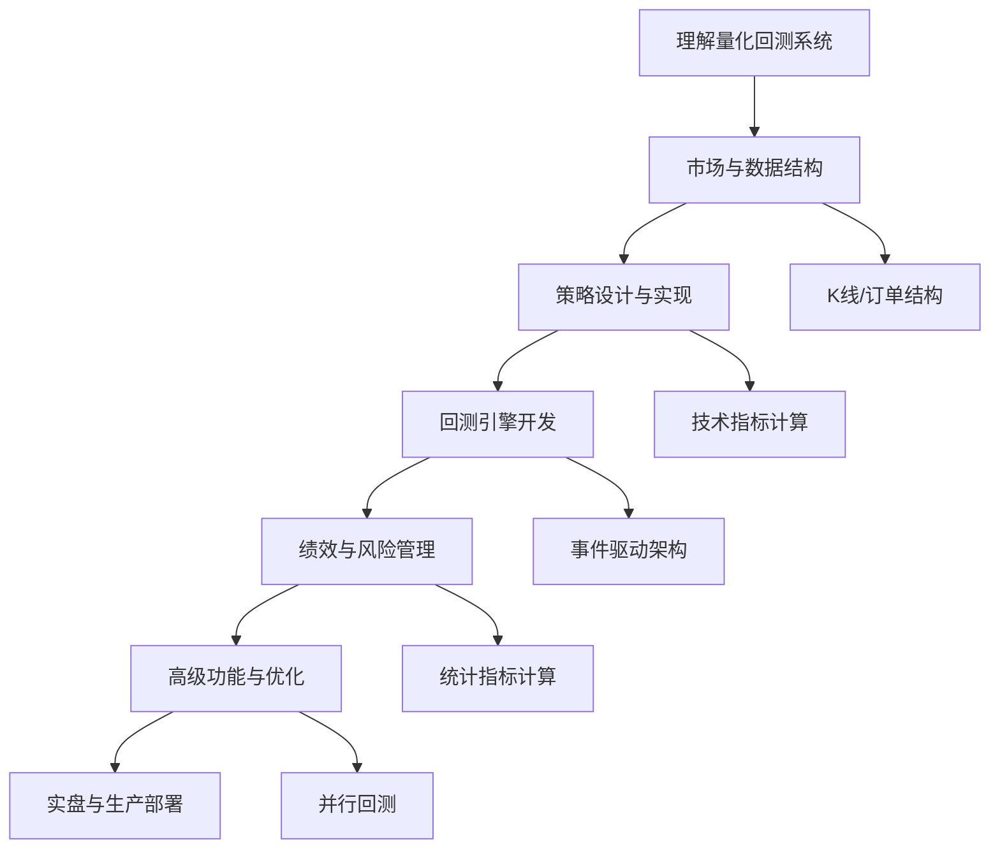

# Rust Actix-Web Learning


# Rust量化交易系统开发指南：从回测到实盘

我将指导您用Rust逐步构建一个完整的量化交易系统。我们将采用模块化设计，确保系统高性能、安全且易于扩展。

## 🎯 第一阶段：回测系统开发

### 1. 项目初始化与架构设计

```bash
# 创建项目
cargo new quant_rs --lib
cd quant_rs

# 添加依赖
cargo add chrono
cargo add serde --features derive
cargo add serde_json
cargo add tokio --features full
cargo add csv
cargo add anyhow
cargo add thiserror
cargo add polars --features "lazy"
cargo add rand
```

### 2. 核心数据结构

```rust
// src/data/mod.rs
use chrono::{DateTime, NaiveDateTime, Utc};
use serde::{Deserialize, Serialize};
use std::collections::HashMap;

/// K线数据
#[derive(Debug, Clone, Serialize, Deserialize)]
pub struct Bar {
    pub symbol: String,
    pub timestamp: DateTime<Utc>,
    pub open: f64,
    pub high: f64,
    pub low: f64,
    pub close: f64,
    pub volume: f64,
    pub turnover: Option<f64>,  // 成交额
}

/// 分时Tick数据
#[derive(Debug, Clone)]
pub struct Tick {
    pub symbol: String,
    pub timestamp: DateTime<Utc>,
    pub last_price: f64,
    pub volume: f64,
    pub bid_price: f64,
    pub bid_volume: f64,
    pub ask_price: f64,
    pub ask_volume: f64,
}

/// 订单方向
#[derive(Debug, Clone, Copy, PartialEq, Eq, Serialize, Deserialize)]
pub enum Direction {
    Long,
    Short,
}

/// 订单状态
#[derive(Debug, Clone, Copy, PartialEq, Eq)]
pub enum OrderStatus {
    Pending,     // 待成交
    PartFilled,  // 部分成交
    Filled,      // 完全成交
    Cancelled,   // 已取消
    Rejected,    // 已拒绝
}

/// 订单类型
#[derive(Debug, Clone, Copy)]
pub enum OrderType {
    Market,     // 市价单
    Limit(f64), // 限价单
    Stop(f64),  // 止损单
}

/// 订单
#[derive(Debug, Clone)]
pub struct Order {
    pub id: u64,
    pub symbol: String,
    pub direction: Direction,
    pub order_type: OrderType,
    pub quantity: f64,
    pub filled_quantity: f64,
    pub status: OrderStatus,
    pub timestamp: DateTime<Utc>,
    pub price: Option<f64>,  // 成交均价
}
```

### 3. 回测引擎核心

```rust
// src/backtest/mod.rs
use crate::data::{Bar, Order, Tick};
use crate::strategy::Strategy;
use crate::portfolio::Portfolio;
use chrono::{DateTime, Utc};
use std::collections::VecDeque;
use tokio::sync::mpsc;

/// 回测配置
#[derive(Debug, Clone)]
pub struct BacktestConfig {
    pub initial_capital: f64,
    pub start_date: DateTime<Utc>,
    pub end_date: DateTime<Utc>,
    pub commission_rate: f64,     // 手续费率
    pub slippage_rate: f64,       // 滑点率
    pub data_frequency: DataFrequency,
}

/// 数据频率
#[derive(Debug, Clone, Copy)]
pub enum DataFrequency {
    Tick,
    Minute,
    Hour,
    Day,
}

/// 回测引擎
pub struct BacktestEngine {
    config: BacktestConfig,
    strategies: HashMap<String, Box<dyn Strategy>>,
    portfolio: Portfolio,
    data_source: Box<dyn DataSource>,
    event_bus: EventBus,
    
    // 统计数据
    trades: Vec<Trade>,
    equity_curve: Vec<(DateTime<Utc>, f64)>,
    max_drawdown: f64,
    sharpe_ratio: f64,
}

impl BacktestEngine {
    /// 创建新的回测引擎
    pub fn new(config: BacktestConfig, data_source: Box<dyn DataSource>) -> Self {
        let portfolio = Portfolio::new(config.initial_capital);
        
        Self {
            config,
            strategies: HashMap::new(),
            portfolio,
            data_source,
            event_bus: EventBus::new(),
            trades: Vec::new(),
            equity_curve: Vec::new(),
            max_drawdown: 0.0,
            sharpe_ratio: 0.0,
        }
    }
    
    /// 添加策略
    pub fn add_strategy(&mut self, name: String, strategy: Box<dyn Strategy>) {
        self.strategies.insert(name, strategy);
    }
    
    /// 运行回测
    pub async fn run(&mut self) -> BacktestResult {
        println!("开始回测...");
        
        // 初始化
        self.on_initialize().await?;
        
        // 主回测循环
        while let Some(data) = self.data_source.next().await {
            match data {
                MarketData::Bar(bar) => {
                    // 更新策略
                    for (name, strategy) in &mut self.strategies {
                        strategy.on_bar(&bar).await;
                    }
                    
                    // 更新投资组合
                    self.portfolio.update(&bar).await?;
                    
                    // 记录权益曲线
                    self.equity_curve.push((bar.timestamp, self.portfolio.equity()));
                }
                MarketData::Tick(tick) => {
                    // 处理Tick数据
                    for strategy in self.strategies.values_mut() {
                        strategy.on_tick(&tick).await;
                    }
                }
            }
            
            // 处理订单
            self.process_orders().await?;
            
            // 检查停止条件
            if self.should_stop() {
                break;
            }
        }
        
        // 计算统计指标
        self.calculate_metrics().await?;
        
        println!("回测完成!");
        Ok(self.generate_report())
    }
    
    /// 处理订单
    async fn process_orders(&mut self) -> Result<(), BacktestError> {
        // 获取所有待处理订单
        let pending_orders = self.portfolio.get_pending_orders();
        
        for order in pending_orders {
            // 根据订单类型和当前市场价模拟成交
            let (fill_price, fill_qty) = self.simulate_fill(&order).await?;
            
            if fill_qty > 0.0 {
                // 创建成交记录
                let fill = Fill {
                    order_id: order.id,
                    symbol: order.symbol.clone(),
                    price: fill_price,
                    quantity: fill_qty,
                    commission: self.calculate_commission(fill_price, fill_qty),
                    timestamp: Utc::now(),
                };
                
                // 更新投资组合
                self.portfolio.apply_fill(&fill).await?;
                
                // 记录交易
                self.record_trade(fill).await;
            }
        }
        
        Ok(())
    }
    
    /// 模拟订单成交
    async fn simulate_fill(&self, order: &Order) -> Result<(f64, f64), BacktestError> {
        let current_price = self.data_source.current_price(&order.symbol).await?;
        
        match order.order_type {
            OrderType::Market => {
                // 市价单：加入滑点
                let slippage = if order.direction == Direction::Long {
                    current_price * (1.0 + self.config.slippage_rate)
                } else {
                    current_price * (1.0 - self.config.slippage_rate)
                };
                Ok((slippage, order.quantity))
            }
            OrderType::Limit(limit_price) => {
                // 限价单：检查价格条件
                if (order.direction == Direction::Long && current_price <= limit_price)
                    || (order.direction == Direction::Short && current_price >= limit_price)
                {
                    Ok((limit_price, order.quantity))
                } else {
                    Ok((0.0, 0.0)) // 未成交
                }
            }
            _ => Ok((0.0, 0.0)),
        }
    }
    
    /// 计算手续费
    fn calculate_commission(&self, price: f64, quantity: f64) -> f64 {
        price * quantity * self.config.commission_rate
    }
    
    /// 计算统计指标
    async fn calculate_metrics(&mut self) -> Result<(), BacktestError> {
        if self.equity_curve.len() < 2 {
            return Ok(());
        }
        
        // 计算收益率序列
        let mut returns = Vec::new();
        for i in 1..self.equity_curve.len() {
            let prev = self.equity_curve[i-1].1;
            let curr = self.equity_curve[i].1;
            if prev > 0.0 {
                returns.push((curr - prev) / prev);
            }
        }
        
        // 计算最大回撤
        let mut peak = f64::MIN;
        let mut max_dd = 0.0;
        
        for &(_, equity) in &self.equity_curve {
            if equity > peak {
                peak = equity;
            }
            let drawdown = (peak - equity) / peak;
            if drawdown > max_dd {
                max_dd = drawdown;
            }
        }
        self.max_drawdown = max_dd;
        
        // 计算夏普比率（假设无风险利率为0.03）
        if !returns.is_empty() {
            let mean_return: f64 = returns.iter().sum::<f64>() / returns.len() as f64;
            let variance: f64 = returns.iter()
                .map(|r| (r - mean_return).powi(2))
                .sum::<f64>() / returns.len() as f64;
            let std_dev = variance.sqrt();
            
            if std_dev > 0.0 {
                // 年化夏普比率
                self.sharpe_ratio = (mean_return * 252.0) / (std_dev * 252.0f64.sqrt());
            }
        }
        
        Ok(())
    }
    
    /// 生成回测报告
    fn generate_report(&self) -> BacktestResult {
        BacktestResult {
            initial_capital: self.config.initial_capital,
            final_equity: self.portfolio.equity(),
            total_return: (self.portfolio.equity() - self.config.initial_capital) 
                / self.config.initial_capital,
            max_drawdown: self.max_drawdown,
            sharpe_ratio: self.sharpe_ratio,
            total_trades: self.trades.len(),
            win_rate: self.calculate_win_rate(),
            profit_factor: self.calculate_profit_factor(),
            equity_curve: self.equity_curve.clone(),
            trades: self.trades.clone(),
        }
    }
}
```

### 4. 策略框架

```rust
// src/strategy/mod.rs
use crate::data::{Bar, Tick, Order, Direction};
use crate::portfolio::Portfolio;
use async_trait::async_trait;

/// 策略特征
#[async_trait]
pub trait Strategy: Send + Sync {
    /// 策略名称
    fn name(&self) -> &str;
    
    /// 初始化
    async fn initialize(&mut self, portfolio: &mut Portfolio);
    
    /// 处理K线数据
    async fn on_bar(&mut self, bar: &Bar);
    
    /// 处理Tick数据
    async fn on_tick(&mut self, tick: &Tick);
    
    /// 获取持仓
    fn positions(&self) -> &HashMap<String, f64>;
    
    /// 生成信号
    async fn generate_signals(&mut self) -> Vec<Signal>;
}

/// 交易信号
#[derive(Debug, Clone)]
pub struct Signal {
    pub symbol: String,
    pub direction: SignalDirection,
    pub strength: f64,  // 信号强度 0.0-1.0
    pub price: Option<f64>,
    pub quantity: f64,
}

/// 信号方向
#[derive(Debug, Clone, Copy)]
pub enum SignalDirection {
    Buy,
    Sell,
    Hold,
}

/// 移动平均线策略示例
pub struct MovingAverageStrategy {
    name: String,
    fast_period: usize,
    slow_period: usize,
    position: f64,
    fast_ma: f64,
    slow_ma: f64,
    price_history: VecDeque<f64>,
    signals: VecDeque<Signal>,
}

impl MovingAverageStrategy {
    pub fn new(fast_period: usize, slow_period: usize) -> Self {
        Self {
            name: format!("MA{}_{}", fast_period, slow_period),
            fast_period,
            slow_period,
            position: 0.0,
            fast_ma: 0.0,
            slow_ma: 0.0,
            price_history: VecDeque::with_capacity(slow_period + 10),
            signals: VecDeque::new(),
        }
    }
    
    fn calculate_ma(&self, period: usize) -> f64 {
        if self.price_history.len() < period {
            return 0.0;
        }
        self.price_history.iter()
            .rev()
            .take(period)
            .sum::<f64>() / period as f64
    }
}

#[async_trait]
impl Strategy for MovingAverageStrategy {
    fn name(&self) -> &str {
        &self.name
    }
    
    async fn initialize(&mut self, _portfolio: &mut Portfolio) {
        // 初始化逻辑
    }
    
    async fn on_bar(&mut self, bar: &Bar) {
        // 更新价格序列
        self.price_history.push_back(bar.close);
        if self.price_history.len() > self.slow_period + 10 {
            self.price_history.pop_front();
        }
        
        // 计算移动平均
        if self.price_history.len() >= self.fast_period {
            self.fast_ma = self.calculate_ma(self.fast_period);
        }
        if self.price_history.len() >= self.slow_period {
            self.slow_ma = self.calculate_ma(self.slow_period);
        }
        
        // 生成交易信号
        if self.price_history.len() >= self.slow_period {
            let signal = if self.fast_ma > self.slow_ma && self.position <= 0.0 {
                // 金叉买入信号
                Signal {
                    symbol: bar.symbol.clone(),
                    direction: SignalDirection::Buy,
                    strength: 0.8,
                    price: None,
                    quantity: 100.0, // 示例数量
                }
            } else if self.fast_ma < self.slow_ma && self.position >= 0.0 {
                // 死叉卖出信号
                Signal {
                    symbol: bar.symbol.clone(),
                    direction: SignalDirection::Sell,
                    strength: 0.8,
                    price: None,
                    quantity: 100.0,
                }
            } else {
                // 持有
                Signal {
                    symbol: bar.symbol.clone(),
                    direction: SignalDirection::Hold,
                    strength: 0.0,
                    price: None,
                    quantity: 0.0,
                }
            };
            
            self.signals.push_back(signal);
        }
    }
    
    async fn on_tick(&mut self, _tick: &Tick) {
        // 对于基于K线的策略，可以空实现
    }
    
    fn positions(&self) -> &HashMap<String, f64> {
        // 简化的持仓管理
        &HashMap::new()
    }
    
    async fn generate_signals(&mut self) -> Vec<Signal> {
        self.signals.drain(..).collect()
    }
}
```

### 5. 投资组合管理

```rust
// src/portfolio/mod.rs
use crate::data::{Bar, Order, Fill, Direction};
use chrono::{DateTime, Utc};
use std::collections::HashMap;

/// 持仓
#[derive(Debug, Clone)]
pub struct Position {
    pub symbol: String,
    pub direction: Direction,
    pub quantity: f64,
    pub avg_price: f64,
    pub market_value: f64,
    pub unrealized_pnl: f64,
    pub realized_pnl: f64,
}

/// 投资组合
pub struct Portfolio {
    pub initial_capital: f64,
    pub cash: f64,
    pub positions: HashMap<String, Position>,
    pub orders: HashMap<u64, Order>,
    pub equity: f64,
    pub margin_used: f64,
    
    // 交易记录
    pub trades: Vec<Trade>,
    pub fills: Vec<Fill>,
}

impl Portfolio {
    pub fn new(initial_capital: f64) -> Self {
        Self {
            initial_capital,
            cash: initial_capital,
            positions: HashMap::new(),
            orders: HashMap::new(),
            equity: initial_capital,
            margin_used: 0.0,
            trades: Vec::new(),
            fills: Vec::new(),
        }
    }
    
    /// 更新持仓市值
    pub async fn update(&mut self, bar: &Bar) -> Result<(), PortfolioError> {
        if let Some(position) = self.positions.get_mut(&bar.symbol) {
            // 更新市值
            position.market_value = bar.close * position.quantity;
            
            // 更新浮动盈亏
            let cost = position.avg_price * position.quantity;
            position.unrealized_pnl = match position.direction {
                Direction::Long => position.market_value - cost,
                Direction::Short => cost - position.market_value,
            };
        }
        
        // 更新总权益
        self.equity = self.cash + self.total_market_value();
        
        Ok(())
    }
    
    /// 提交订单
    pub async fn submit_order(&mut self, order: Order) -> Result<u64, PortfolioError> {
        let order_id = self.generate_order_id();
        self.orders.insert(order_id, order);
        Ok(order_id)
    }
    
    /// 应用成交
    pub async fn apply_fill(&mut self, fill: &Fill) -> Result<(), PortfolioError> {
        // 更新现金
        let trade_value = fill.price * fill.quantity;
        self.cash -= trade_value;
        self.cash -= fill.commission;
        
        // 更新或创建持仓
        let position = self.positions
            .entry(fill.symbol.clone())
            .or_insert_with(|| Position {
                symbol: fill.symbol.clone(),
                direction: Direction::Long, // 简化处理
                quantity: 0.0,
                avg_price: 0.0,
                market_value: 0.0,
                unrealized_pnl: 0.0,
                realized_pnl: 0.0,
            });
        
        // 更新持仓
        let old_quantity = position.quantity;
        let old_value = old_quantity * position.avg_price;
        let new_value = old_value + trade_value;
        
        position.quantity += fill.quantity;
        if position.quantity != 0.0 {
            position.avg_price = new_value / position.quantity;
        }
        
        // 记录成交
        self.fills.push(fill.clone());
        
        Ok(())
    }
    
    /// 计算总市值
    fn total_market_value(&self) -> f64 {
        self.positions.values()
            .map(|p| p.market_value)
            .sum()
    }
    
    /// 生成订单ID
    fn generate_order_id(&self) -> u64 {
        // 简单实现，生产环境应使用更健壮的ID生成
        std::time::SystemTime::now()
            .duration_since(std::time::UNIX_EPOCH)
            .unwrap()
            .as_nanos() as u64
    }
}
```

### 6. 数据源模块

```rust
// src/data_source/mod.rs
use crate::data::{Bar, Tick};
use async_trait::async_trait;
use chrono::{DateTime, Utc};
use std::path::Path;

/// 数据源特征
#[async_trait]
pub trait DataSource: Send + Sync {
    /// 获取下一条数据
    async fn next(&mut self) -> Option<MarketData>;
    
    /// 获取当前价格
    async fn current_price(&self, symbol: &str) -> Result<f64, DataError>;
    
    /// 重置到开始
    async fn reset(&mut self);
}

/// 市场数据类型
pub enum MarketData {
    Bar(Bar),
    Tick(Tick),
}

/// CSV数据源
pub struct CsvDataSource {
    file_path: String,
    symbol: String,
    frequency: DataFrequency,
    bars: Vec<Bar>,
    current_index: usize,
}

impl CsvDataSource {
    pub async fn new(
        file_path: impl AsRef<Path>,
        symbol: &str,
        frequency: DataFrequency,
    ) -> Result<Self, DataError> {
        let mut rdr = csv::Reader::from_path(file_path)?;
        let mut bars = Vec::new();
        
        for result in rdr.deserialize() {
            let record: CsvBar = result?;
            bars.push(record.into_bar(symbol));
        }
        
        Ok(Self {
            file_path: file_path.as_ref().to_string_lossy().to_string(),
            symbol: symbol.to_string(),
            frequency,
            bars,
            current_index: 0,
        })
    }
}

#[async_trait]
impl DataSource for CsvDataSource {
    async fn next(&mut self) -> Option<MarketData> {
        if self.current_index >= self.bars.len() {
            return None;
        }
        
        let bar = self.bars[self.current_index].clone();
        self.current_index += 1;
        
        Some(MarketData::Bar(bar))
    }
    
    async fn current_price(&self, symbol: &str) -> Result<f64, DataError> {
        if symbol != self.symbol {
            return Err(DataError::SymbolNotFound(symbol.to_string()));
        }
        
        if self.current_index == 0 || self.current_index > self.bars.len() {
            return Err(DataError::NoDataAvailable);
        }
        
        Ok(self.bars[self.current_index - 1].close)
    }
    
    async fn reset(&mut self) {
        self.current_index = 0;
    }
}

/// CSV数据格式
#[derive(Debug, Deserialize)]
struct CsvBar {
    timestamp: String,
    open: f64,
    high: f64,
    low: f64,
    close: f64,
    volume: f64,
}

impl CsvBar {
    fn into_bar(self, symbol: &str) -> Bar {
        // 解析时间戳，这里简化处理
        let dt = DateTime::parse_from_rfc3339(&self.timestamp)
            .unwrap()
            .with_timezone(&Utc);
        
        Bar {
            symbol: symbol.to_string(),
            timestamp: dt,
            open: self.open,
            high: self.high,
            low: self.low,
            close: self.close,
            volume: self.volume,
            turnover: None,
        }
    }
}
```

## 🎯 第二阶段：逐步完善完整交易系统

### 7. 实盘交易引擎

```rust
// src/trading/mod.rs
use crate::data::{Order, Tick};
use crate::portfolio::Portfolio;
use crate::broker::Broker;
use tokio::sync::mpsc;
use std::collections::HashMap;

/// 交易引擎状态
#[derive(Debug, Clone, Copy, PartialEq)]
pub enum TradingState {
    Stopped,
    Initializing,
    Running,
    Paused,
    Stopping,
}

/// 交易引擎配置
#[derive(Debug, Clone)]
pub struct TradingEngineConfig {
    pub broker_url: String,
    pub api_key: String,
    pub secret_key: String,
    pub max_position: f64,        // 最大持仓比例
    pub max_order_size: f64,      // 最大单笔订单
    pub risk_per_trade: f64,      // 单笔交易风险
}

/// 实盘交易引擎
pub struct TradingEngine {
    config: TradingEngineConfig,
    state: TradingState,
    broker: Box<dyn Broker>,
    strategies: HashMap<String, Box<dyn Strategy>>,
    portfolio: Portfolio,
    order_manager: OrderManager,
    risk_manager: RiskManager,
    
    // 通信通道
    market_data_rx: mpsc::Receiver<Tick>,
    signal_tx: mpsc::Sender<Signal>,
    order_tx: mpsc::Sender<Order>,
}

impl TradingEngine {
    pub async fn new(config: TradingEngineConfig) -> Result<Self, TradingError> {
        // 连接券商API
        let broker = connect_broker(&config).await?;
        
        // 初始化投资组合
        let account_info = broker.get_account_info().await?;
        let portfolio = Portfolio::from_account(account_info);
        
        Ok(Self {
            config,
            state: TradingState::Stopped,
            broker,
            strategies: HashMap::new(),
            portfolio,
            order_manager: OrderManager::new(),
            risk_manager: RiskManager::new(),
            market_data_rx: mpsc::channel(1000).1,
            signal_tx: mpsc::channel(100).0,
            order_tx: mpsc::channel(100).0,
        })
    }
    
    /// 启动交易引擎
    pub async fn start(&mut self) -> Result<(), TradingError> {
        if self.state != TradingState::Stopped {
            return Err(TradingError::InvalidState);
        }
        
        self.state = TradingState::Initializing;
        println!("交易引擎初始化中...");
        
        // 1. 初始化所有策略
        for strategy in self.strategies.values_mut() {
            strategy.initialize(&mut self.portfolio).await;
        }
        
        // 2. 启动市场数据订阅
        self.subscribe_market_data().await?;
        
        // 3. 启动各组件任务
        tokio::spawn(self.run_market_data_loop());
        tokio::spawn(self.run_signal_processing_loop());
        tokio::spawn(self.run_order_processing_loop());
        tokio::spawn(self.run_risk_monitoring_loop());
        
        self.state = TradingState::Running;
        println!("交易引擎已启动");
        
        Ok(())
    }
    
    /// 市场数据处理循环
    async fn run_market_data_loop(&mut self) {
        while self.state == TradingState::Running {
            match self.market_data_rx.recv().await {
                Some(tick) => {
                    // 更新所有策略
                    for strategy in self.strategies.values_mut() {
                        strategy.on_tick(&tick).await;
                    }
                    
                    // 更新投资组合
                    if let Err(e) = self.portfolio.update_from_tick(&tick).await {
                        eprintln!("更新投资组合失败: {:?}", e);
                    }
                }
                None => {
                    tokio::time::sleep(tokio::time::Duration::from_millis(10)).await;
                }
            }
        }
    }
    
    /// 信号处理循环
    async fn run_signal_processing_loop(&mut self) {
        while self.state == TradingState::Running {
            // 从策略收集信号
            let mut all_signals = Vec::new();
            for strategy in self.strategies.values_mut() {
                let signals = strategy.generate_signals().await;
                all_signals.extend(signals);
            }
            
            // 过滤和合并信号
            let filtered_signals = self.filter_signals(all_signals).await;
            
            // 风险检查
            let approved_signals = self.risk_manager.check_signals(&filtered_signals).await;
            
            // 生成订单
            for signal in approved_signals {
                if let Ok(order) = self.create_order_from_signal(signal).await {
                    if let Err(e) = self.order_tx.send(order).await {
                        eprintln!("发送订单失败: {:?}", e);
                    }
                }
            }
            
            tokio::time::sleep(tokio::time::Duration::from_millis(100)).await;
        }
    }
    
    /// 订单处理循环
    async fn run_order_processing_loop(&mut self) {
        while self.state == TradingState::Running {
            match self.order_tx.recv().await {
                Some(order) => {
                    // 发送订单到券商
                    match self.broker.submit_order(order.clone()).await {
                        Ok(order_id) => {
                            println!("订单已提交: {}", order_id);
                            self.order_manager.track_order(order_id, order).await;
                        }
                        Err(e) => {
                            eprintln!("订单提交失败: {:?}", e);
                        }
                    }
                }
                None => {
                    tokio::time::sleep(tokio::time::Duration::from_millis(10)).await;
                }
            }
        }
    }
}
```

### 8. 风险管理模块

```rust
// src/risk/mod.rs
use crate::data::{Order, Signal};
use crate::portfolio::Portfolio;
use std::collections::HashMap;

/// 风险规则
#[derive(Debug, Clone)]
pub struct RiskRule {
    pub name: String,
    pub max_position: f64,           // 最大持仓比例
    pub max_daily_loss: f64,         // 单日最大亏损
    pub max_order_size: f64,         // 最大单笔订单
    pub max_drawdown: f64,           // 最大回撤
    pub blacklist: Vec<String>,      // 黑名单
}

/// 风险管理器
pub struct RiskManager {
    rules: HashMap<String, RiskRule>,
    daily_pnl: f64,
    max_drawdown: f64,
    peak_equity: f64,
}

impl RiskManager {
    pub fn new() -> Self {
        Self {
            rules: HashMap::new(),
            daily_pnl: 0.0,
            max_drawdown: 0.0,
            peak_equity: 0.0,
        }
    }
    
    /// 检查信号是否通过风控
    pub async fn check_signals(&mut self, signals: &[Signal]) -> Vec<Signal> {
        let mut approved = Vec::new();
        
        for signal in signals {
            if self.is_signal_allowed(signal).await {
                approved.push(signal.clone());
            }
        }
        
        approved
    }
    
    /// 检查订单是否通过风控
    pub async fn check_order(&mut self, order: &Order, portfolio: &Portfolio) -> Result<(), RiskError> {
        // 1. 检查黑名单
        if self.is_symbol_blacklisted(&order.symbol).await {
            return Err(RiskError::BlacklistedSymbol(order.symbol.clone()));
        }
        
        // 2. 检查最大持仓
        let current_position = portfolio.get_position(&order.symbol)
            .map(|p| p.quantity)
            .unwrap_or(0.0);
        
        let new_position = match order.direction {
            Direction::Long => current_position + order.quantity,
            Direction::Short => current_position - order.quantity,
        };
        
        if new_position.abs() > self.get_max_position(&order.symbol).await {
            return Err(RiskError::ExceedsMaxPosition);
        }
        
        // 3. 检查单笔订单限制
        if order.quantity > self.get_max_order_size(&order.symbol).await {
            return Err(RiskError::ExceedsMaxOrderSize);
        }
        
        // 4. 检查资金利用率
        let order_value = order.quantity * order.price.unwrap_or(0.0);
        if order_value > portfolio.cash * 0.9 {
            return Err(RiskError::InsufficientCash);
        }
        
        Ok(())
    }
    
    /// 更新风控状态
    pub async fn update(&mut self, portfolio: &Portfolio) {
        // 更新最大回撤
        let equity = portfolio.equity();
        if equity > self.peak_equity {
            self.peak_equity = equity;
        }
        
        let drawdown = (self.peak_equity - equity) / self.peak_equity;
        if drawdown > self.max_drawdown {
            self.max_drawdown = drawdown;
        }
        
        // 检查是否触发风控
        if self.should_stop_trading(portfolio).await {
            eprintln!("触发风控，停止交易！");
            // 这里应该触发停止交易逻辑
        }
    }
}
```

### 9. 配置文件与日志

```rust
// src/config/mod.rs
use serde::{Deserialize, Serialize};
use std::fs;
use std::path::Path;

/// 主配置
#[derive(Debug, Clone, Serialize, Deserialize)]
pub struct Config {
    pub trading: TradingConfig,
    pub data: DataConfig,
    pub strategies: Vec<StrategyConfig>,
    pub risk: RiskConfig,
    pub logging: LoggingConfig,
}

/// 交易配置
#[derive(Debug, Clone, Serialize, Deserialize)]
pub struct TradingConfig {
    pub broker: BrokerType,
    pub api_key: String,
    pub secret_key: String,
    pub test_mode: bool,
    pub max_position_ratio: f64,
    pub commission_rate: f64,
}

/// 券商类型
#[derive(Debug, Clone, Serialize, Deserialize)]
pub enum BrokerType {
    Simulated,  // 模拟交易
    TdAmeritrade,
    InteractiveBrokers,
    Binance,
    Huobi,
}

impl Config {
    pub fn from_file<P: AsRef<Path>>(path: P) -> Result<Self, ConfigError> {
        let content = fs::read_to_string(path)?;
        let config: Config = toml::from_str(&content)?;
        Ok(config)
    }
    
    pub fn validate(&self) -> Result<(), ConfigError> {
        if self.trading.max_position_ratio <= 0.0 || self.trading.max_position_ratio > 1.0 {
            return Err(ConfigError::InvalidValue(
                "max_position_ratio must be between 0 and 1".to_string()
            ));
        }
        
        Ok(())
    }
}
```

### 10. 监控与Web界面

```rust
// src/web/mod.rs
use actix_web::{web, App, HttpResponse, HttpServer, Responder};
use actix_web::rt::time::interval;
use std::sync::Arc;
use tokio::sync::RwLock;
use serde_json::json;

/// Web服务器
pub struct WebServer {
    engine: Arc<RwLock<TradingEngine>>,
    metrics: Arc<RwLock<MetricsCollector>>,
}

impl WebServer {
    pub async fn new(engine: Arc<RwLock<TradingEngine>>) -> Self {
        Self {
            engine,
            metrics: Arc::new(RwLock::new(MetricsCollector::new())),
        }
    }
    
    pub async fn start(&self, port: u16) -> std::io::Result<()> {
        let engine = self.engine.clone();
        let metrics = self.metrics.clone();
        
        // 启动指标收集
        self.start_metrics_collection().await;
        
        HttpServer::new(move || {
            App::new()
                .app_data(web::Data::new(engine.clone()))
                .app_data(web::Data::new(metrics.clone()))
                .route("/", web::get().to(index))
                .route("/status", web::get().to(status))
                .route("/portfolio", web::get().to(portfolio))
                .route("/positions", web::get().to(positions))
                .route("/orders", web::get().to(orders))
                .route("/metrics", web::get().to(get_metrics))
                .route("/strategies", web::get().to(strategies))
                .route("/control/start", web::post().to(start_trading))
                .route("/control/stop", web::post().to(stop_trading))
                .route("/control/pause", web::post().to(pause_trading))
        })
        .bind(("127.0.0.1", port))?
        .run()
        .await
    }
    
    async fn start_metrics_collection(&self) {
        let engine = self.engine.clone();
        let metrics = self.metrics.clone();
        
        tokio::spawn(async move {
            let mut interval = interval(Duration::from_secs(5));
            
            loop {
                interval.tick().await;
                
                let engine_guard = engine.read().await;
                let mut metrics_guard = metrics.write().await;
                
                // 收集指标
                metrics_guard.collect(&engine_guard).await;
            }
        });
    }
}
```

## 🎯 第三阶段：部署与优化

### 11. 构建完整系统

```rust
// src/main.rs
mod config;
mod data;
mod backtest;
mod trading;
mod strategy;
mod portfolio;
mod risk;
mod web;

use crate::config::Config;
use crate::trading::TradingEngine;
use std::sync::Arc;
use tokio::sync::RwLock;
use clap::{Parser, Subcommand};

/// 量化交易系统
#[derive(Parser)]
#[command(name = "QuantRS")]
#[command(about = "Rust量化交易系统", long_about = None)]
struct Cli {
    #[command(subcommand)]
    command: Commands,
}

#[derive(Subcommand)]
enum Commands {
    /// 运行回测
    Backtest {
        /// 配置文件路径
        #[arg(short, long)]
        config: String,
        
        /// 回测开始日期
        #[arg(short, long)]
        start: String,
        
        /// 回测结束日期
        #[arg(short, long)]
        end: String,
    },
    
    /// 运行实盘交易
    Trade {
        /// 配置文件路径
        #[arg(short, long)]
        config: String,
    },
    
    /// 运行Web界面
    Web {
        /// 配置文件路径
        #[arg(short, long)]
        config: String,
        
        /// 端口号
        #[arg(short, long, default_value = "8080")]
        port: u16,
    },
    
    /// 优化策略参数
    Optimize {
        /// 策略配置文件
        #[arg(short, long)]
        strategy: String,
    },
}

#[tokio::main]
async fn main() -> Result<(), Box<dyn std::error::Error>> {
    // 初始化日志
    env_logger::init();
    
    let cli = Cli::parse();
    
    match cli.command {
        Commands::Backtest { config, start, end } => {
            run_backtest(&config, &start, &end).await?;
        }
        Commands::Trade { config } => {
            run_trading(&config).await?;
        }
        Commands::Web { config, port } => {
            run_web(&config, port).await?;
        }
        Commands::Optimize { strategy } => {
            run_optimization(&strategy).await?;
        }
    }
    
    Ok(())
}

async fn run_backtest(config_path: &str, start: &str, end: &str) -> Result<(), Box<dyn std::error::Error>> {
    println!("开始回测...");
    println!("配置文件: {}", config_path);
    println!("回测期间: {} 到 {}", start, end);
    
    // 加载配置
    let config = Config::from_file(config_path)?;
    config.validate()?;
    
    // 创建回测引擎
    let mut engine = backtest::BacktestEngine::new(
        config.backtest.clone(),
        config.data.clone(),
    ).await?;
    
    // 加载策略
    for strategy_cfg in &config.strategies {
        let strategy = create_strategy(strategy_cfg).await?;
        engine.add_strategy(strategy_cfg.name.clone(), strategy).await;
    }
    
    // 运行回测
    let result = engine.run().await?;
    
    // 输出结果
    println!("回测结果:");
    println!("初始资金: {:.2}", result.initial_capital);
    println!("最终权益: {:.2}", result.final_equity);
    println!("总收益率: {:.2}%", result.total_return * 100.0);
    println!("夏普比率: {:.2}", result.sharpe_ratio);
    println!("最大回撤: {:.2}%", result.max_drawdown * 100.0);
    println!("总交易次数: {}", result.total_trades);
    println!("胜率: {:.2}%", result.win_rate * 100.0);
    
    // 保存结果
    save_backtest_result(&result).await?;
    
    Ok(())
}

async fn run_trading(config_path: &str) -> Result<(), Box<dyn std::error::Error>> {
    println!("启动实盘交易...");
    
    // 加载配置
    let config = Config::from_file(config_path)?;
    config.validate()?;
    
    // 创建交易引擎
    let engine = TradingEngine::new(config.trading.clone()).await?;
    let engine_arc = Arc::new(RwLock::new(engine));
    
    // 启动交易引擎
    {
        let mut engine = engine_arc.write().await;
        engine.start().await?;
    }
    
    // 保持运行
    tokio::signal::ctrl_c().await?;
    println!("收到停止信号，正在关闭...");
    
    // 停止引擎
    {
        let mut engine = engine_arc.write().await;
        engine.stop().await?;
    }
    
    Ok(())
}
```

## 📁 项目结构

```
quant_rs/
├── Cargo.toml
├── src/
│   ├── main.rs                 # 程序入口
│   ├── lib.rs                  # 库入口
│   ├── config/                 # 配置管理
│   │   ├── mod.rs
│   │   └── config.rs
│   ├── data/                   # 数据结构
│   │   ├── mod.rs
│   │   ├── bar.rs
│   │   ├── tick.rs
│   │   └── order.rs
│   ├── backtest/               # 回测引擎
│   │   ├── mod.rs
│   │   ├── engine.rs
│   │   └── result.rs
│   ├── trading/                # 实盘交易
│   │   ├── mod.rs
│   │   ├── engine.rs
│   │   └── broker/            # 券商接口
│   │       ├── mod.rs
│   │       ├── simulated.rs    # 模拟交易
│   │       └── binance.rs      # 币安接口
│   ├── strategy/               # 策略框架
│   │   ├── mod.rs
│   │   ├── base.rs
│   │   └── ma_strategy.rs     # 移动平均策略
│   ├── portfolio/              # 投资组合
│   │   ├── mod.rs
│   │   └── portfolio.rs
│   ├── risk/                   # 风险管理
│   │   ├── mod.rs
│   │   └── manager.rs
│   ├── indicators/             # 技术指标
│   │   ├── mod.rs
│   │   ├── ma.rs
│   │   └── macd.rs
│   └── web/                    # Web界面
│       ├── mod.rs
│       └── server.rs
├── config/                     # 配置文件
│   ├── trading.toml
│   └── strategies/
│       └── ma_strategy.toml
├── data/                       # 数据文件
│   ├── csv/
│   └── database/
├── tests/                      # 测试
└── scripts/                    # 工具脚本
```

## 🚀 开发路线图

### 第一阶段：基础回测系统（1-2周）
1. 完成核心数据结构定义
2. 实现CSV数据源读取
3. 完成简单策略（如双均线）
4. 实现基本回测引擎
5. 添加绩效统计

### 第二阶段：完善回测功能（1-2周）
1. 添加更多技术指标
2. 实现多种订单类型
3. 添加手续费和滑点模型
4. 实现多时间框架支持
5. 添加事件驱动架构

### 第三阶段：实盘交易（2-3周）
1. 实现券商接口抽象
2. 完成模拟交易接口
3. 集成真实券商API
4. 实现风险管理模块
5. 添加日志和监控

### 第四阶段：高级功能（2-3周）
1. 实现参数优化
2. 添加机器学习组件
3. 实现高性能回测优化
4. 开发Web监控界面
5. 添加Docker部署支持

## 🔧 关键优化点

1. **性能优化**：
   - 使用Polars进行向量化计算
   - 使用Rayon进行并行计算
   - 优化内存管理，避免频繁分配

2. **代码质量**：
   - 使用Rust的错误处理
   - 编写单元测试
   - 实现性能基准测试

3. **安全性**：
   - 安全的API密钥管理
   - 输入验证和清理
   - 防注入攻击

4. **可扩展性**：
   - 插件化策略系统
   - 支持多种数据源
   - 模块化设计

## 📈 下一步建议

1. **先从回测系统开始**：实现一个可工作的回测引擎，验证策略逻辑
2. **逐步添加功能**：先完成核心功能，再逐步扩展
3. **充分测试**：编写测试用例，确保系统稳定
4. **性能优化**：在功能完善后，针对性能瓶颈进行优化
5. **安全加固**：实盘前进行充分的安全测试

这个系统设计考虑了可扩展性、性能和安全性，您可以按照这个路线图逐步实现。需要特定模块的详细实现或有其他问题，请随时询问！

我将为您设计一个**从顶层到底层、理论与实践结合**的量化回测系统学习与开发路径。这个路径既包含宏观架构理解，也深入底层实现细节。

## 🎯 整体学习路径图



## 📅 详细学习计划（预计3-4个月）

### 阶段1：基础认知与架构设计（1-2周）

#### 1.1 理解量化回测的本质
- **目标**：理解为什么需要回测，回测能解决什么问题
- **学习内容**：
  - 回测vs实盘：前视偏差、过拟合、幸存者偏差
  - 回测系统的基本流程：数据→策略→订单→成交→绩效
  - 事件驱动 vs 向量化回测

#### 1.2 设计顶层架构
```rust
// 顶层架构设计
pub trait QuantSystem {
    // 数据层
    trait DataSource { /* 获取市场数据 */ }
    
    // 策略层
    trait Strategy { /* 生成交易信号 */ }
    
    // 执行层
    trait OrderHandler { /* 处理订单 */ }
    
    // 投资组合
    trait Portfolio { /* 管理资金和持仓 */ }
    
    // 回测引擎
    trait BacktestEngine { /* 协调所有组件 */ }
}
```

### 阶段2：核心数据结构实现（2-3周）

#### 2.1 市场数据结构
```rust
// 第一天：定义K线数据
#[derive(Debug, Clone, Serialize, Deserialize)]
pub struct Bar {
    pub symbol: String,
    pub timestamp: DateTime<Utc>,
    pub open: f64,
    pub high: f64,
    pub low: f64,
    pub close: f64,
    pub volume: f64,
    pub turnover: Option<f64>,
}

// 第二天：定义Tick数据
pub struct Tick {
    pub symbol: String,
    pub timestamp: DateTime<Utc>,
    pub last_price: f64,
    pub bid: (f64, f64),  // (价格, 数量)
    pub ask: (f64, f64),
    pub volume: f64,
}
```

#### 2.2 交易相关结构
```rust
// 第三天：订单和交易
#[derive(Debug, Clone)]
pub enum Direction {
    Long,
    Short,
}

#[derive(Debug, Clone)]
pub enum OrderType {
    Market,
    Limit(f64),
    Stop(f64),
}

pub struct Order {
    pub id: u64,
    pub symbol: String,
    pub direction: Direction,
    pub order_type: OrderType,
    pub quantity: f64,
    pub filled_quantity: f64,
    pub status: OrderStatus,
    pub timestamp: DateTime<Utc>,
}
```

### 阶段3：技术指标与策略（2-3周）

#### 3.1 实现技术指标库
```rust
// 第一周：移动平均线家族
pub mod indicators {
    pub trait Indicator {
        fn update(&mut self, value: f64) -> f64;
        fn value(&self) -> f64;
    }
    
    pub struct SimpleMovingAverage {
        period: usize,
        values: VecDeque<f64>,
    }
    
    pub struct ExponentialMovingAverage {
        period: usize,
        alpha: f64,
        current: Option<f64>,
    }
    
    pub struct MACD {
        fast_ema: ExponentialMovingAverage,
        slow_ema: ExponentialMovingAverage,
        signal_ema: ExponentialMovingAverage,
    }
}
```

#### 3.2 策略框架
```rust
// 第二周：策略抽象
#[async_trait]
pub trait Strategy: Send + Sync {
    async fn initialize(&mut self, context: &Context);
    async fn on_bar(&mut self, bar: &Bar) -> Vec<Signal>;
    async fn on_tick(&mut self, tick: &Tick) -> Vec<Signal>;
    fn name(&self) -> &str;
}

// 实现一个双均线策略
pub struct MovingAverageCrossover {
    fast_period: usize,
    slow_period: usize,
    fast_ma: f64,
    slow_ma: f64,
    position: f64,
    price_history: VecDeque<f64>,
}
```

### 阶段4：回测引擎核心（3-4周）

#### 4.1 事件驱动架构
```rust
// 第一周：事件系统
#[derive(Debug, Clone)]
pub enum Event {
    Bar(Bar),
    Tick(Tick),
    Order(Order),
    Fill(Fill),
    Signal(Signal),
    Time(DateTime<Utc>),
}

pub struct EventBus {
    sender: Sender<Event>,
    receiver: Receiver<Event>,
}

impl EventBus {
    pub async fn publish(&self, event: Event) {
        self.sender.send(event).await.ok();
    }
    
    pub async fn subscribe(&mut self) -> Option<Event> {
        self.receiver.recv().await
    }
}
```

#### 4.2 回测引擎实现
```rust
// 第二周：主引擎
pub struct BacktestEngine {
    config: BacktestConfig,
    data_source: Box<dyn DataSource>,
    strategies: HashMap<String, Box<dyn Strategy>>,
    portfolio: Portfolio,
    event_bus: EventBus,
    
    // 统计
    equity_curve: Vec<(DateTime<Utc>, f64)>,
    trades: Vec<Trade>,
}

impl BacktestEngine {
    pub async fn run(&mut self) -> Result<BacktestResult> {
        println!("开始回测...");
        
        // 初始化
        self.initialize().await?;
        
        // 主循环
        while let Some(event) = self.event_bus.subscribe().await {
            match event {
                Event::Bar(bar) => self.process_bar(&bar).await?,
                Event::Tick(tick) => self.process_tick(&tick).await?,
                Event::Order(order) => self.process_order(&order).await?,
                Event::Fill(fill) => self.process_fill(&fill).await?,
                Event::Signal(signal) => self.process_signal(&signal).await?,
                _ => {}
            }
            
            // 检查停止条件
            if self.should_stop() {
                break;
            }
        }
        
        self.generate_report()
    }
}
```

### 阶段5：投资组合与订单执行（2-3周）

#### 5.1 投资组合管理
```rust
pub struct Portfolio {
    pub initial_capital: f64,
    pub cash: f64,
    pub positions: HashMap<String, Position>,
    pub equity_curve: Vec<(DateTime<Utc>, f64)>,
    pub trades: Vec<Trade>,
}

impl Portfolio {
    pub async fn update(&mut self, bar: &Bar) -> Result<()> {
        // 更新持仓市值
        if let Some(position) = self.positions.get_mut(&bar.symbol) {
            position.market_value = bar.close * position.quantity;
            position.unrealized_pnl = position.market_value - (position.avg_price * position.quantity);
        }
        
        // 更新总权益
        self.equity = self.cash + self.total_market_value();
        self.equity_curve.push((bar.timestamp, self.equity));
        
        Ok(())
    }
}
```

#### 5.2 订单执行模拟
```rust
pub struct OrderSimulator {
    commission_rate: f64,
    slippage_rate: f64,
    latency_ms: u64,
}

impl OrderSimulator {
    pub async fn simulate_fill(&self, order: &Order, market_price: f64) -> Option<Fill> {
        // 模拟延迟
        tokio::time::sleep(Duration::from_millis(self.latency_ms)).await;
        
        // 计算成交价（考虑滑点）
        let fill_price = match order.order_type {
            OrderType::Market => {
                let direction_multiplier = match order.direction {
                    Direction::Long => 1.0 + self.slippage_rate,
                    Direction::Short => 1.0 - self.slippage_rate,
                };
                market_price * direction_multiplier
            }
            OrderType::Limit(limit_price) => {
                // 检查限价单条件
                if (order.direction == Direction::Long && market_price <= limit_price) ||
                   (order.direction == Direction::Short && market_price >= limit_price) {
                    limit_price
                } else {
                    return None;
                }
            }
        };
        
        // 计算手续费
        let commission = fill_price * order.quantity * self.commission_rate;
        
        Some(Fill {
            order_id: order.id,
            price: fill_price,
            quantity: order.quantity,
            commission,
            timestamp: Utc::now(),
        })
    }
}
```

### 阶段6：绩效评估与风险管理（2-3周）

#### 6.1 绩效指标计算
```rust
pub mod performance {
    pub struct PerformanceMetrics {
        pub total_return: f64,
        pub annual_return: f64,
        pub sharpe_ratio: f64,
        pub sortino_ratio: f64,
        pub max_drawdown: f64,
        pub calmar_ratio: f64,
        pub win_rate: f64,
        pub profit_factor: f64,
        pub total_trades: usize,
    }
    
    impl PerformanceMetrics {
        pub fn calculate(equity_curve: &[(DateTime<Utc>, f64)], trades: &[Trade]) -> Self {
            // 计算收益率序列
            let returns = Self::calculate_returns(equity_curve);
            
            // 计算夏普比率
            let sharpe = Self::sharpe_ratio(&returns, 0.03);
            
            // 计算最大回撤
            let max_dd = Self::max_drawdown(equity_curve);
            
            // 计算胜率
            let win_rate = Self::win_rate(trades);
            
            Self {
                total_return: (equity_curve.last().unwrap().1 - equity_curve.first().unwrap().1) 
                    / equity_curve.first().unwrap().1,
                annual_return: 0.0, // 计算年化
                sharpe_ratio: sharpe,
                sortino_ratio: 0.0,
                max_drawdown: max_dd,
                calmar_ratio: 0.0,
                win_rate,
                profit_factor: 0.0,
                total_trades: trades.len(),
            }
        }
    }
}
```

#### 6.2 风险管理
```rust
pub mod risk {
    pub struct RiskManager {
        rules: Vec<RiskRule>,
        current_metrics: RiskMetrics,
    }
    
    impl RiskManager {
        pub async fn check_order(&self, order: &Order, portfolio: &Portfolio) -> Result<(), RiskError> {
            for rule in &self.rules {
                match rule {
                    RiskRule::MaxPositionSize(max_size) => {
                        let current = portfolio.get_position_size(&order.symbol);
                        if current + order.quantity > *max_size {
                            return Err(RiskError::ExceedsPositionLimit);
                        }
                    }
                    RiskRule::MaxDrawdown(threshold) => {
                        if portfolio.max_drawdown() > *threshold {
                            return Err(RiskError::MaxDrawdownBreached);
                        }
                    }
                    // 更多风控规则...
                }
            }
            
            Ok(())
        }
    }
}
```

### 阶段7：高级功能与优化（3-4周）

#### 7.1 并行回测
```rust
pub mod parallel {
    use rayon::prelude::*;
    
    pub struct ParallelBacktest {
        engine_pool: Vec<BacktestEngine>,
    }
    
    impl ParallelBacktest {
        pub fn run_parameter_scan(
            &self,
            strategy_factory: impl StrategyFactory,
            parameter_space: &ParameterSpace,
        ) -> Vec<BacktestResult> {
            parameter_space
                .parameters
                .par_iter()  // 并行迭代
                .map(|params| {
                    let mut engine = self.create_engine();
                    let strategy = strategy_factory.create(params);
                    engine.add_strategy(strategy);
                    engine.run().unwrap()
                })
                .collect()
        }
    }
}
```

#### 7.2 机器学习集成
```rust
pub mod ml {
    use linfa::prelude::*;
    
    pub struct MLStrategy {
        model: Box<dyn Model>,
        features: Vec<Feature>,
    }
    
    impl Strategy for MLStrategy {
        async fn on_bar(&mut self, bar: &Bar) -> Vec<Signal> {
            // 提取特征
            let features = self.extract_features(bar);
            
            // 模型预测
            let prediction = self.model.predict(&features);
            
            // 生成信号
            if prediction > 0.5 {
                vec![Signal::buy(bar.symbol.clone(), bar.close)]
            } else {
                vec![Signal::sell(bar.symbol.clone(), bar.close)]
            }
        }
    }
}
```

## 📚 学习资源安排

### 每周学习计划

| 周数 | 重点 | 实践项目 | 理论学习 |
|------|------|----------|----------|
| 1-2 | Rust基础+数据结构 | 实现Bar/Tick/Order结构 | 《Rust编程之道》前5章 |
| 3-4 | 技术指标+策略 | 实现MACD/RSI指标 | 《技术分析》基础 |
| 5-6 | 回测引擎架构 | 简单事件驱动回测 | 《量化交易》第1-3章 |
| 7-8 | 投资组合+订单 | 模拟订单执行 | 投资组合理论 |
| 9-10 | 绩效分析 | 计算夏普/最大回撤 | 风险管理基础 |
| 11-12 | 优化+扩展 | 参数优化框架 | 并行计算原理 |
| 13-16 | 实战项目 | 完整策略回测 | 论文阅读 |

### 每日学习安排（示例）

```
周一：理论学习
  - 上午：阅读相关章节
  - 下午：整理笔记，绘制架构图
  - 晚上：思考实现方案

周二：编码实践
  - 上午：实现核心数据结构
  - 下午：编写单元测试
  - 晚上：代码审查和优化

周三：功能完善
  - 上午：添加新功能
  - 下午：集成测试
  - 晚上：性能分析

周四：问题解决
  - 上午：调试和修复bug
  - 下午：性能优化
  - 晚上：文档编写

周五：总结反思
  - 上午：回顾本周成果
  - 下午：规划下周任务
  - 晚上：技术分享/社区交流
```

## 🔧 开发环境与工具

### 1. 开发环境
```toml
# Cargo.toml
[package]
name = "quant-backtest"
version = "0.1.0"
edition = "2021"

[dependencies]
tokio = { version = "1.0", features = ["full"] }
chrono = { version = "0.4", features = ["serde"] }
serde = { version = "1.0", features = ["derive"] }
anyhow = "1.0"
thiserror = "1.0"
rayon = "1.5"  # 并行计算
polars = { version = "0.15", features = ["lazy"] }  # 数据处理
indicators = "0.7"  # 技术指标库
plotly = "0.8"  # 可视化
```

### 2. 项目结构模板
```bash
quant-backtest/
├── Cargo.toml
├── .cargo/
│   └── config.toml
├── .github/
│   └── workflows/
│       └── ci.yml
├── docs/
│   ├── architecture.md
│   └── api.md
├── examples/
│   ├── simple_strategy.rs
│   └── parameter_optimization.rs
├── src/
│   ├── lib.rs
│   ├── main.rs
│   ├── data/
│   │   ├── mod.rs
│   │   ├── bar.rs
│   │   ├── tick.rs
│   │   ├── source/
│   │   └── processor/
│   ├── strategy/
│   │   ├── mod.rs
│   │   ├── base.rs
│   │   ├── technical/
│   │   └── ml/
│   ├── backtest/
│   │   ├── mod.rs
│   │   ├── engine.rs
│   │   ├── event.rs
│   │   └── simulator.rs
│   ├── portfolio/
│   ├── risk/
│   ├── performance/
│   └── utils/
├── tests/
│   ├── integration/
│   └── unit/
├── data/
│   ├── raw/
│   └── processed/
└── scripts/
    ├── download_data.py
    └── analyze_results.py
```

## 💡 学习建议

### 1. **从简单开始，逐步迭代**
```rust
// 第1版：最简单的回测
fn simple_backtest(bars: &[Bar]) -> f64 {
    let mut cash = 10000.0;
    let mut shares = 0.0;
    
    for bar in bars {
        // 简单策略：价格低于50买入，高于100卖出
        if bar.close < 50.0 && cash > bar.close {
            shares = cash / bar.close;
            cash = 0.0;
        } else if bar.close > 100.0 && shares > 0.0 {
            cash = shares * bar.close;
            shares = 0.0;
        }
    }
    
    cash + shares * bars.last().unwrap().close
}

// 逐步添加：手续费、滑点、多种订单类型...
```

### 2. **测试驱动开发**
```rust
#[cfg(test)]
mod tests {
    use super::*;
    
    #[test]
    fn test_moving_average() {
        let prices = vec![1.0, 2.0, 3.0, 4.0, 5.0];
        let ma = SimpleMovingAverage::new(3);
        
        for price in prices {
            ma.update(price);
        }
        
        assert!((ma.value() - 4.0).abs() < 0.001);
    }
}
```

### 3. **可视化调试**
```rust
pub fn plot_equity_curve(equity_curve: &[(DateTime<Utc>, f64)]) {
    use plotly::common::Mode;
    use plotly::{Plot, Scatter};
    
    let x: Vec<_> = equity_curve.iter().map(|(t, _)| *t).collect();
    let y: Vec<_> = equity_curve.iter().map(|(_, e)| *e).collect();
    
    let trace = Scatter::new(x, y)
        .mode(Mode::Lines)
        .name("Equity Curve");
    
    let mut plot = Plot::new();
    plot.add_trace(trace);
    plot.show();
}
```

## 🎯 关键检查点

### 每月验收标准
1. **第1个月**：能加载数据，计算简单指标
2. **第2个月**：实现基本策略，运行简单回测
3. **第3个月**：完整的回测引擎，绩效分析
4. **第4个月**：优化、扩展功能，准备实盘

### 质量指标
- 代码覆盖率 > 80%
- 关键路径性能达标
- 内存使用合理
- API设计清晰易用

## 💎 总结

这个学习路径从**宏观架构理解**开始，逐步深入到**具体实现细节**，再上升到**高级功能**。关键是要：

1. **先跑通最小可行产品**：即使很简陋，能运行就是胜利
2. **逐步添加功能**：每完成一个功能就测试、文档化
3. **理论与实践结合**：学习理论知识后立即编码实践
4. **社区参与**：阅读优秀开源项目，参与讨论
5. **持续改进**：定期重构，优化代码结构

记住：量化回测系统是一个复杂的工程，需要耐心和系统性的学习。不要试图一次就做出完美的系统，而是通过**迭代开发**逐步完善。

如果您在具体实现过程中遇到问题，可以随时针对具体模块进行深入探讨！